AUTOMATE INFRASTRUCTURE WITH IAC USING TERRAFORM PART 4

Create a terraform cloud account. Verify it via email and create an organization, creeate a workspace, connect gitlab and set enviromet variables by adding aws access and secret keys

Install packer and choco

Use acker to build all 4 amis

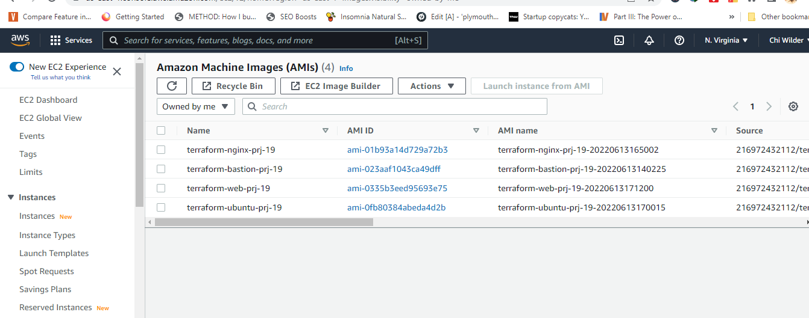

I went to ami folder

Rank packer for each packer file and build the AMIs

Go to davids gitlab and fork his terrform repo and clone it to my pc via vscode.

Do same with his ansible repo.

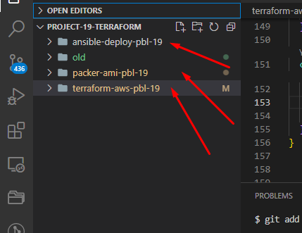

Copy the ami ids for all 4 amis and replace them in the terraform.auto.tfvars file

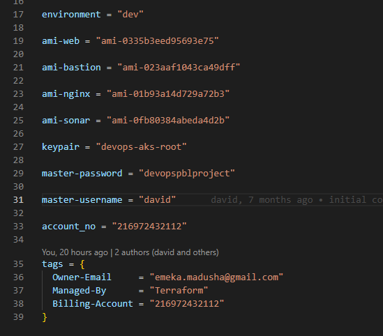

Also replace the pem key and aws acc number

Push everything to gitalb

Now go to terraform cloud and start a run

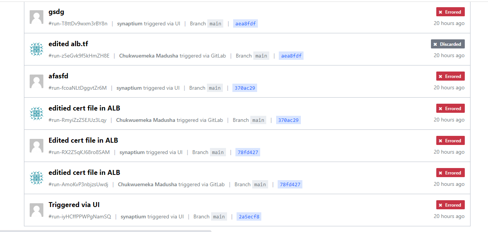

I had many errors and corrected all.

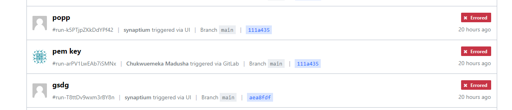

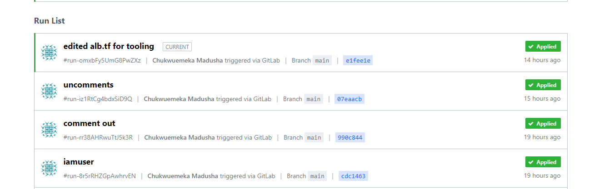

Configure ssh agent

if you are not able to login to ssh within ssh via ssh agent do this

Open gitbash on vscode

run eval `ssh-agent -s`

then ssh-add k pemkey.pemkey

its adds the pem key try again

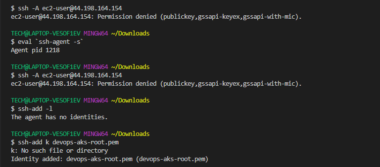

Get the bastion public dns and configure it in vscode to connect via remote host.

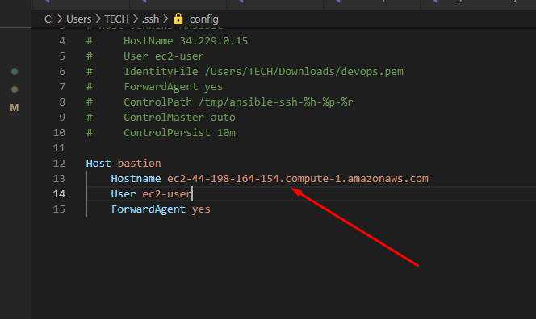

check if aws cli command is inatsalled via the command aws

it was so clone down the ansible repository

Run aws configure to connect aws account to your bastion server.

Make sure ssh agent is working. type ssh-add -l

change dir to ansible folder.

Run ansible-playbook -i inventory/aws_ec2.yml playbooks/site.yml --graph

Did not work

So i had to install pyhton 3.8, boto, botocore and pip3

sudo yum install -y python38
 sudo python3.8 -m pip install boto3 botocore

 You can install pip using this link

 https://shouts.dev/articles/install-pip3-or-pip2-on-rhel-centos8

 It worked now after running this.

 ansible-playbook -i inventory/aws_ec2.yml playbooks/site.yml --graph

Go to aws and copy the dns name for the load balancer.

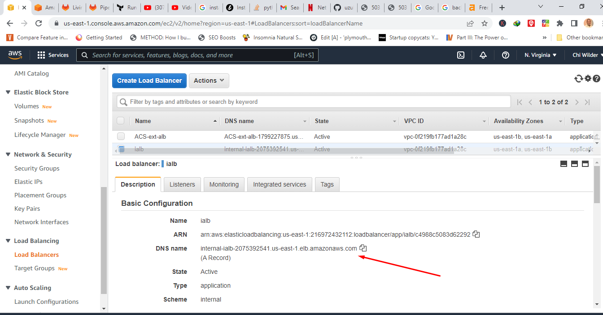

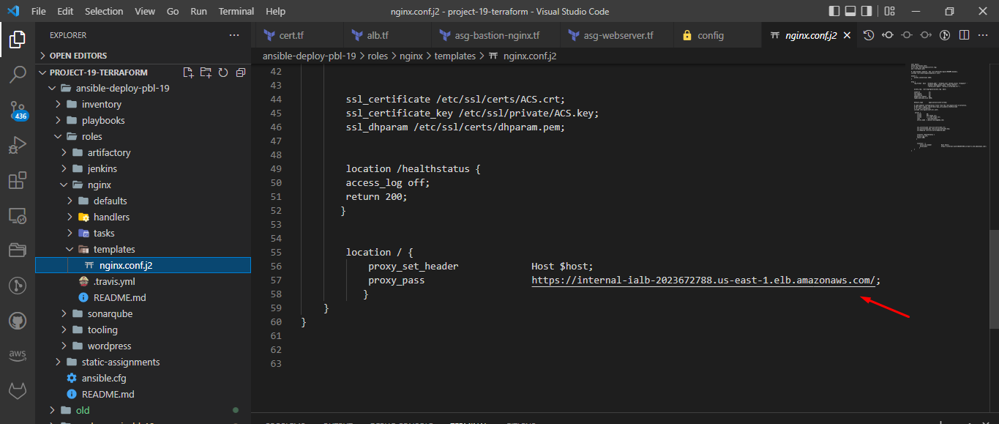

 Go to rds and copy the endpoints

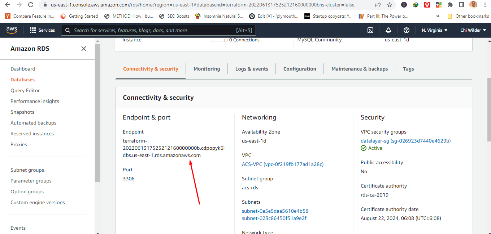

Go to tooling/tasks/setup-db.yml and replace

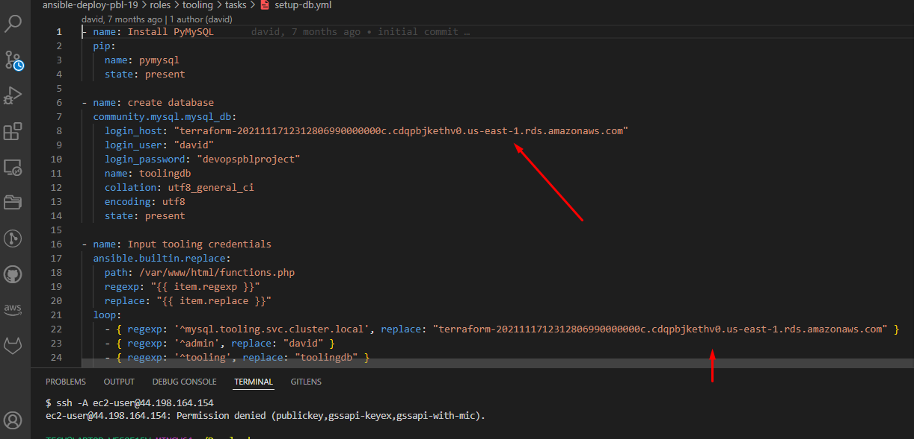

edit the same thing in wordpress/tasks/setup-db.yml

Now to edit the mouting file share system.

Go to Efs on amazon

We have access points for wordpress and access points for tooling

For wordpress

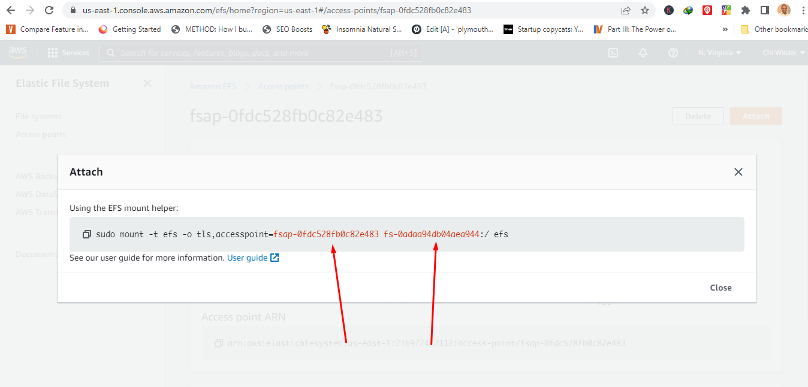

For tooling

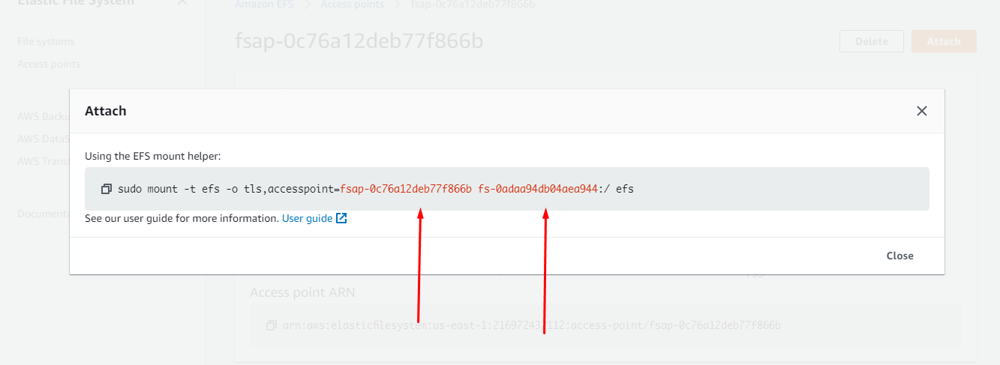

Edit wordpress/tasks/main.yml

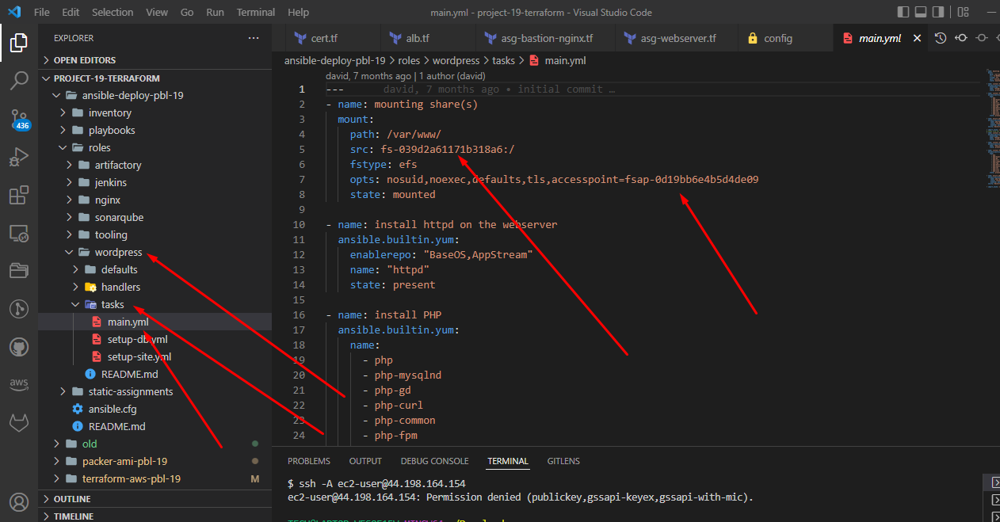

Do same for tooling

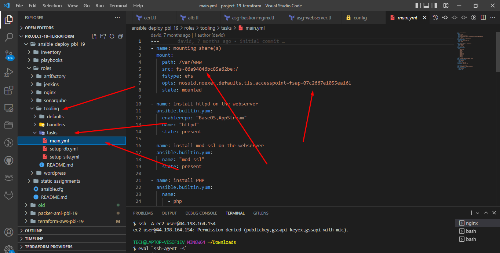

Pushed it.

So

Now i logged in to the bastion server via remote ssh

Go to ansible folder and run

ansible-playbook -i inventory/aws_ec2.yml playbooks/site.yml

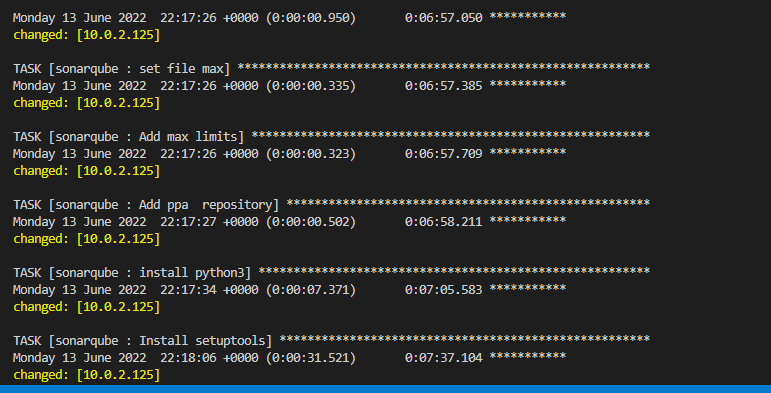

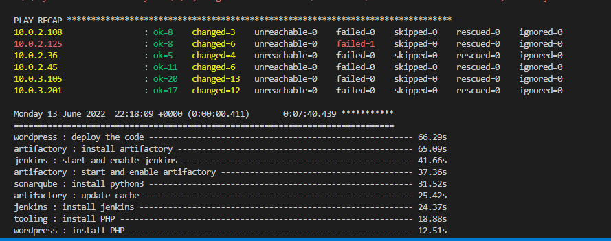

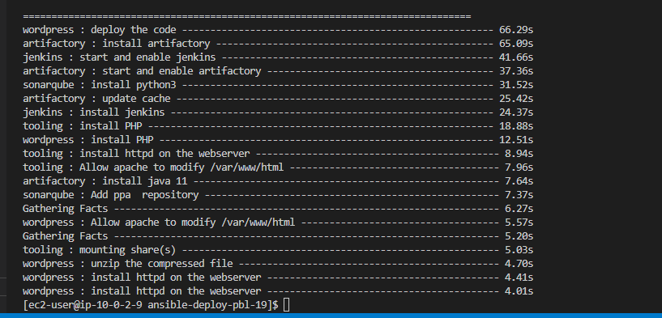

Now login to the bastion on a seperate window via ssh

Now from there access the nginx server 

chck to make sure nginx is instaled and running by typing

sudo systemctl status nginx

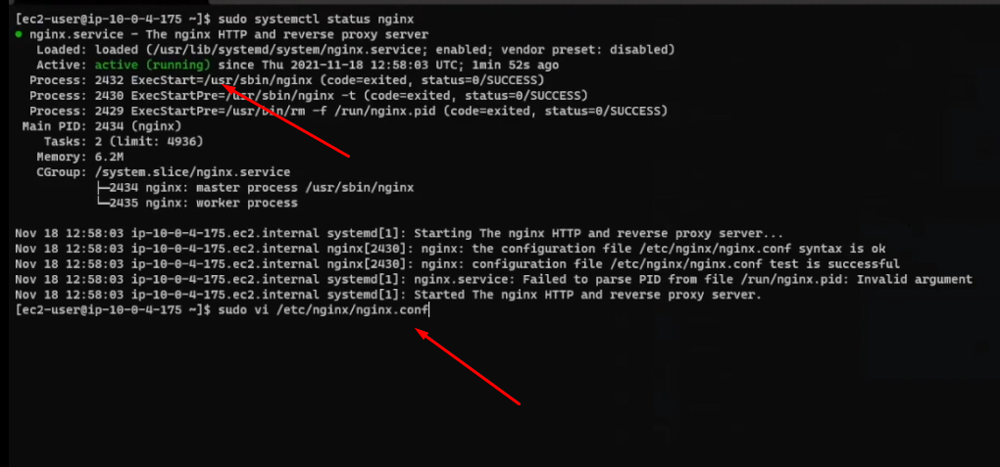

Run sudo vi /etc/nginx/nginx.conf to edit the nginx config file

Login to nginx and tooling via ssh and do df -h

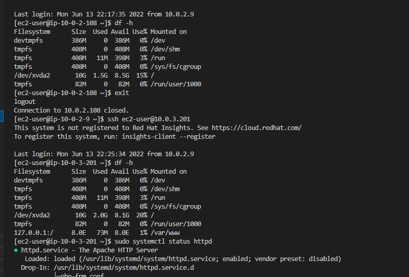

Run curl in your wordpress server

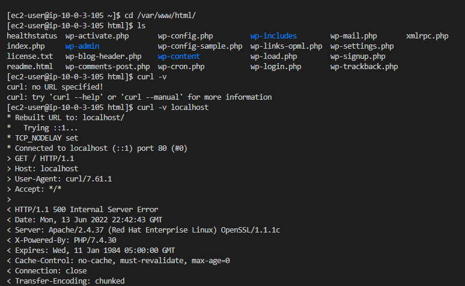

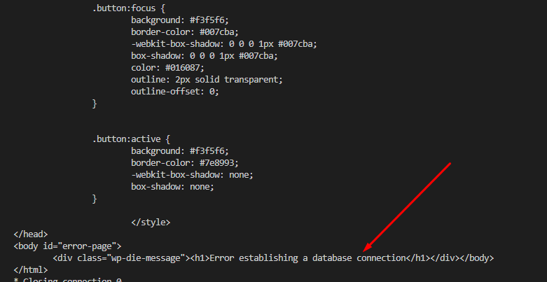

See database is not connected.

So we run sudo vi wp-config.php to edit

Do some edits on the files and push - see davids video

Sites load

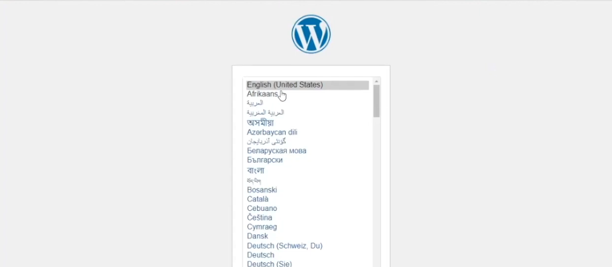

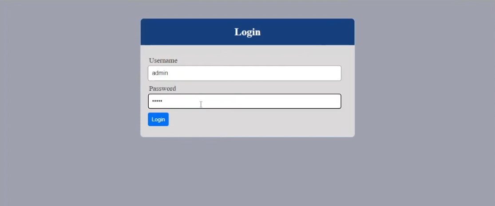